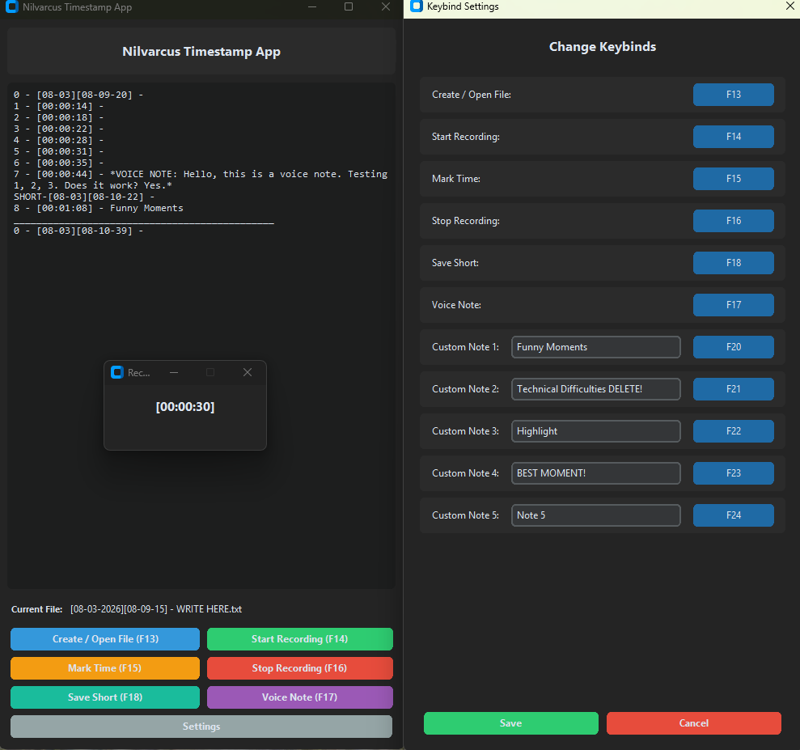

# Nilvarcus Timestamp App



A professional, streamlined Python application designed for content creators (e.g., OBS Studio, Replay Buffer users) to efficiently mark and manage timestamps during video recordings. Featuring a modern dark UI, global hotkey support, and AI-powered voice transcription.

## 🚀 Key Features

*   **Modern Dark UI:** A sleek, high-contrast interface built with `CustomTkinter` for a professional look.
*   **AI Voice Transcription:** Integrated `OpenAI Whisper` support. Record 10-second voice notes that are transcribed in the background and appended directly to your log.
*   **Floating Status Widget:** An "Always-on-Top" mini-timer that displays recording status and confirms actions (e.g., "Timestamp Marked!") without obstructing your workspace.
*   **Global Hotkeys:** Full support for `F13-F24` keys, allowing seamless integration with Stream Decks, AutoHotkey, or specialized macros.
*   **Dynamic Custom Notes:** 5 configurable hotkeys to instantly inject pre-defined phrases (e.g., "Funny Moment", "Death", "Epic Play") into your timeline.
*   **Advanced Markdown Formatting:** Generates clean, bolded, and highly readable `.md` files:
    *   **Bolded Counters:** `**[1]**`
    *   **Bolded Timestamps:** `**[00:00:00]**`
    *   **Clean Separation:** Automatic newlines for Starting Notes, Ending Notes, and SHORTS.
*   **Autosave & Persistence:** Background autosaving ensures you never lose a mark, even if the app closes unexpectedly.

## ⌨️ Default Keybinds

| Action | Key | Description |
| :--- | :--- | :--- |
| **Create/Open File** | `F13` | Initialize a new session file in the `Timestamp_TXT` folder. |
| **Start Recording** | `F14` | Synchronize the stopwatch with your recording start. |
| **Mark Time** | `F15` | Instantly drop a bolded timestamp mark. |
| **Stop Recording** | `F16` | Finalize the log with total duration and a separator. |
| **Voice Note** | `F17` | Record 10s of audio for AI transcription. |
| **Save Short** | `F18` | Create a separated header for a Short or Replay Buffer clip. |
| **Custom Notes** | `F20-F24`| Inject your 5 pre-configured text notes. |

## 🛠️ Installation & Setup

### Prerequisites
- **Python 3.x**
- **FFmpeg** (Required for OpenAI Whisper audio processing)

### Dependencies
```bash
pip install customtkinter pynput openai-whisper sounddevice numpy
```

### Running the App
```bash
python timestamp_gui.py
```

## 💡 Usage Tips

*   **OBS Integration:** Match your OBS recording filename format to `[%d-%m-%Y][%H-%M-%S]` for perfect synchronization between video files and timestamp logs.
*   **Stream Deck/AHK:** Use these tools to map your hardware buttons to the `F13-F24` keys for a hands-free experience while gaming or recording.
*   **Video Editing:** Use the generated Markdown files to quickly navigate your footage in editors like DaVinci Resolve or Premiere Pro.

## 📄 License
This project is licensed under the MIT License - see the [LICENSE](LICENSE) file for details.

---
*Developed by Nilvarcus. Designed for creators, by a creator.*
